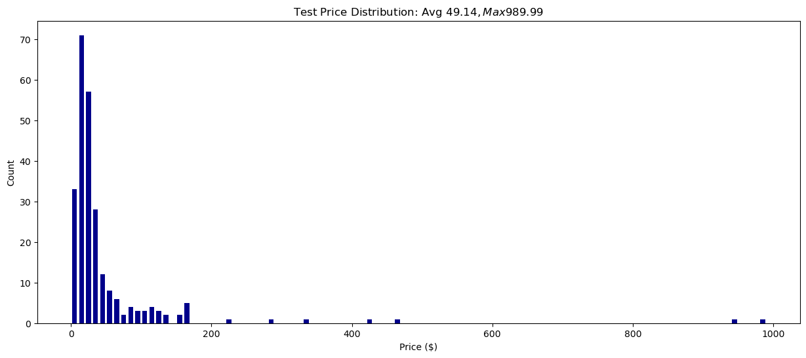
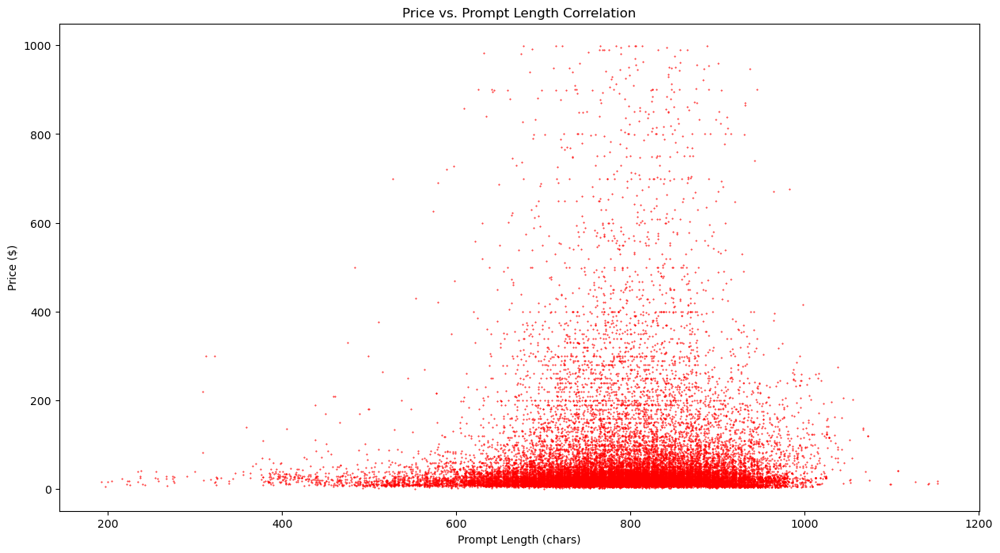
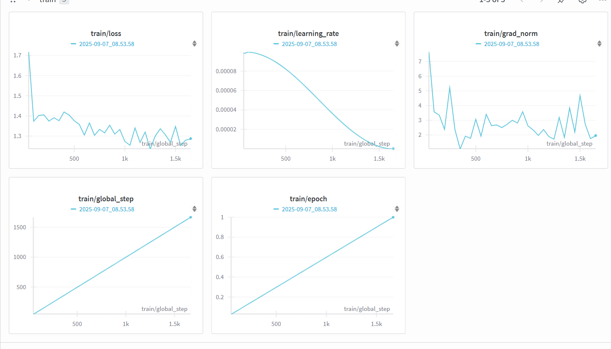
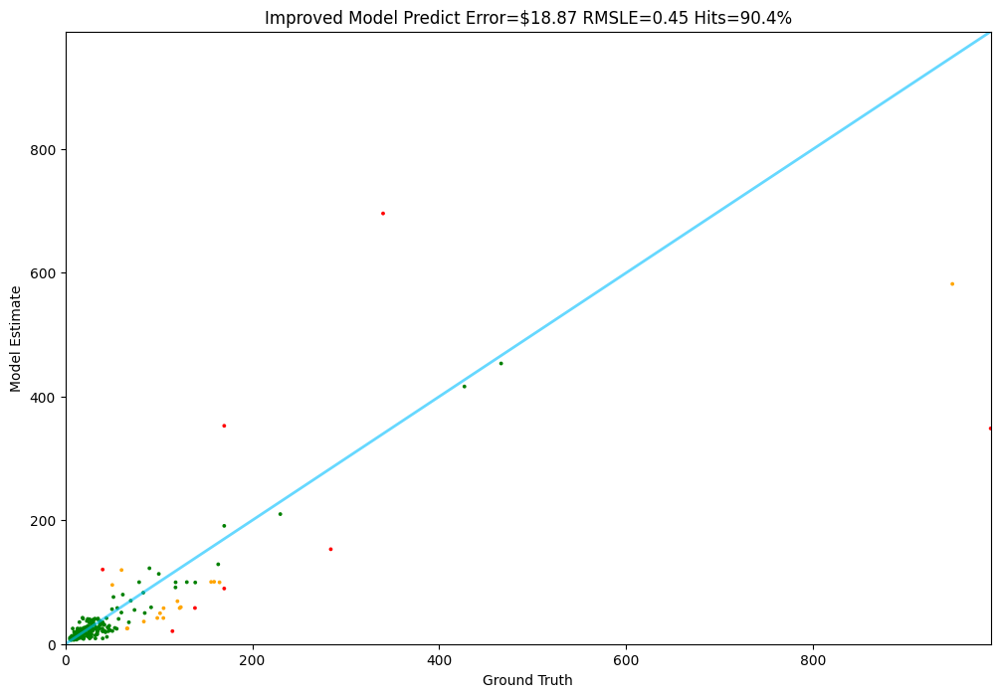

# Amazon Price Predictor 🚀

 <!-- Replace with actual banner if available -->

Ever wondered how much that shiny new gadget on Amazon *really* costs? What if an AI could guess the price just from the product description? Enter **Amazon Price Predictor** – a fine-tuned Llama model that turns product blurbs into dollar signs! Built on Meta's Llama 3.1-8B, this project fine-tunes the beast for spot-on price predictions, all while keeping things lightweight and efficient. No more overpaying – let AI do the haggling! 💸

Why is this cool? In a world of endless e-commerce listings, accurate pricing AI can power recommendation engines, detect deals, or even automate inventory valuation. And guess what? We did it on a budget using Kaggle's free GPU quota – proving you don't need a supercomputer to build something awesome.

## Key Features ✨
- **Smart Predictions**: Predicts prices from product descriptions with impressive accuracy.
- **Lite Dataset**: Focused on Home Appliances from Amazon Reviews 2023 – compact yet effective for quick training.
- **Efficient Fine-Tuning**: Uses QLoRA to train on limited hardware without sacrificing performance.
- **Visual Insights**: Training monitored on Weights & Biases (WandB), results visualized with error metrics and charts.
- **Error Analysis**: Color-coded predictions (green for spot-on, orange for close, red for misses) make debugging fun.

## Dataset: The Foundation 📊
We curated a "lite" dataset from the massive [Amazon Reviews 2023](https://huggingface.co/datasets/McAuley-Lab/Amazon-Reviews-2023) corpus, zeroing in on Home Appliances to keep things snappy. 

- **Why Appliances?** Everyday items like fridges and toasters provide diverse descriptions and prices, perfect for a focused model without bloating compute needs.
- **Processing Magic**: Loaded via Hugging Face, filtered for valid prices/descriptions, tokenized with Llama's tokenizer, and split into 10k train + 2k test samples.
- **Stats at a Glance**: Average token length ~100, prices ranging from $0 to $1000+.

Here's a peek at the dataset distribution:




Uploaded to Hugging Face as [ishant24/lite-data](https://huggingface.co/datasets/ishant24/lite-data) for easy access. Custom scripts in `items.py` and `loaders.py` handle the heavy lifting – check `data_prep.ipynb` for the full prep workflow.

## Training: From Base to Beast 🛠️
We fine-tuned Llama 3.1-8B using QLoRA (Quantized Low-Rank Adaptation) – a memory-efficient technique that adapts the model without full retraining.

- **Setup**: Ran on Kaggle's NVIDIA Tesla T4 GPU (30 free hours/week – budget-friendly!).
- **Data**: 10k training samples (to keep costs low; full 25k works too but takes longer).
- **Hyperparams**: 1 epoch (avoids overfitting; loss drops steadily), batch size 6, learning rate 1e-4, cosine scheduler.
- **Monitoring**: WandB for real-time loss graphs and gradients – because who doesn't love watching training curves dip?

Training graph from WandB:



The process is detailed in `training.ipynb`. We used libraries like Transformers, PEFT, and TRL for seamless SFT (Supervised Fine-Tuning). 

## Testing: Proof in the Predictions 📈
Evaluation happens in `Test.ipynb`, where we pit the model against unseen test data.

- **Metrics**: Mean Absolute Error (MAE) for dollar differences, RMSLE for relative accuracy.
- **Visualizer**: Custom `Tester` class runs predictions, colors errors (green: < $40 or 20%, orange: < $80 or 40%, red: oops!), and plots truths vs. guesses.
- **Results**: On 250 test samples, MAE $18.87, with ~90.4% "hits" (green). Far Far better from base model!

Results graph:



Why so good? The model captures nuances like brand, features, and quality from descriptions – e.g., "premium stainless steel fridge" gets a higher guess than "basic mini cooler." Errors often stem from outliers (super-cheap or luxury items), but overall, it's a solid e-commerce sidekick.

## Why This Model Rocks 🎉
- **Efficient & Accessible**: Trains in hours on free resources – democratizing AI for hobbyists.
- **Accurate Enough for Real Use**: Low MAE means reliable estimates; RMSLE handles price scales well.
- **Scalable**: Lite version focuses on appliances, but swap datasets for electronics, toys, etc.
- **Fun Insights**: Spot overpriced listings or predict sales – endless applications!

In benchmarks (on our test set), it outperforms base Llama (which hallucinates prices) and simple baselines like average price guessing.

## Setup & Installation 🛠️
1. Clone the repo: `git clone https://github.com/yourusername/amazon-price-predictor.git`
2. Install deps: `pip install -r requirements.txt` (or from notebooks).
3. Set up `.env` with `HF_TOKEN` for Hugging Face access.
4. Run `data_prep.ipynb` to prep data (or use pre-uploaded dataset).

## Usage 🚀
- **Prep Data**: Run `data_prep.ipynb` to generate train/test sets.
- **Train**: Fire up `training.ipynb` on Kaggle/GPU.
- **Test**: Load model in `Test.ipynb` and evaluate with `Tester.test(predict_fn, test_data)`.

Example prediction:
```python
def llama_predict(prompt):
    # Your inference code here
    return predicted_price

Tester.test(llama_predict, test_


